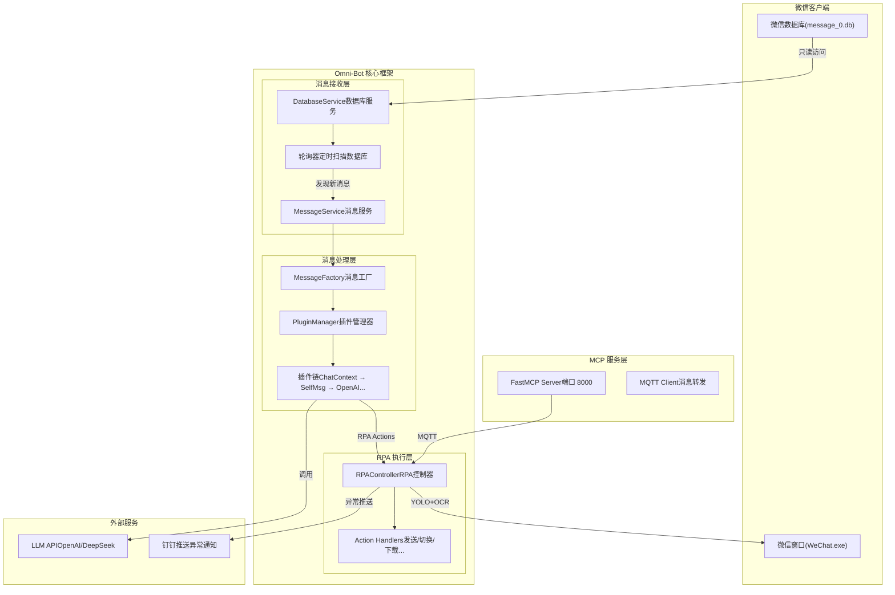
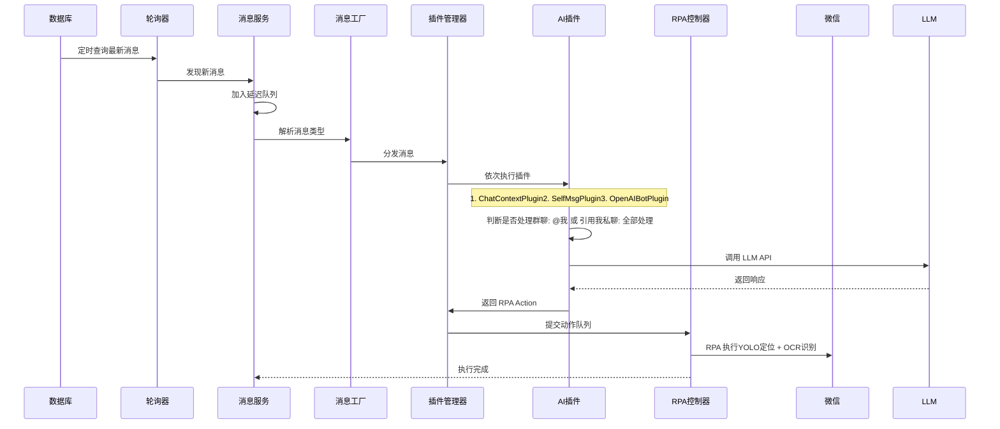

# Omni-Bot-SDK：基于视觉识别的微信RPA框架

> ⚠️ **免责声明**
> 
> 本项目仅用于个人学习和技术交流。**严禁**用于营销、发广告等商业行为。使用本项目存在微信被封号的风险，**作者不承担任何法律责任**。请务必遵守微信软件许可协议。

🙅‍♂️**禁止使用范围**：
本项目严禁用于营销、发广告等任何企业或商业行为，仅推荐用于个人学习和技术交流用途。

☂️**隐私与安全声明**：
本项目不联网，不收集任何用户数据，所有运行数据均保留在用户电脑本地。
本项目不会对微信数据库进行任何写操作，不影响微信的正常运行。

🤖 **项目简介**

Omni-Bot-SDK 是一个**运行时零侵入**的微信自动化框架。它不依赖复杂的逆向工程或Hook技术，而是通过**"视觉感知+数据驱动"**的方式，模拟人类操作习惯，安全、稳定地构建你的专属微信机器人。

🙏 **鸣谢**
本项目基于开源项目 **[chat-mind-rpa](https://github.com/weixin-omni/chat-mind-rpa)** 进行二次开发。
原作者已停止维护，本分支在此基础上新增：**API 调用方式、消息撤回功能、对接微信 ilink 协议、掉线自动发送二维码**等能力。

## 🌟 核心原理：像人一样"看"和"做"

本项目的核心逻辑完全基于**视觉识别（OCR）**与**本地数据交互**，确保在不干扰微信正常运行的前提下实现自动化：

1.  **消息获取（数据源驱动）**：
    框架通过轮询读取微信本地数据库（只读模式），实时捕获最新消息，确保消息接收几乎零延迟。
2.  **决策处理（逻辑大脑）**：
    收到消息后，根据预设规则或LLM（大语言模型）生成回复内容。
3.  **自动化执行（视觉RPA）**：
    *   **定位**：利用OCR技术识别微信客户端界面，根据联系人名称在左上角搜索框进行查找。
    *   **交互**：识别到目标联系人后，模拟鼠标点击进入对话框。
    *   **发送**：将生成的内容复制粘贴至输入框，识别"发送"按钮并点击，完成全流程闭环。
    *   **撤回**：通过OCR识别消息内容和右键菜单，自动定位并点击"撤回"按钮，支持按内容、关键词或最新消息撤回。

---

## 🚀 快速开始

### 1. 环境准备
*   **Python版本**：必须使用 **Python 3.12** (项目依赖要求)
*   **微信版本**：支持 Windows 微信 4.1.8.29 及以上版本

### 2. 安装依赖 (三种方式)

本项目支持多种安装方式，建议开发者根据需求选择。

#### 方式 A：使用项目自带的开发安装脚本（推荐）
这是最便捷的方式，适合希望直接修改源码的开发者。
```bash
# 1. 进入项目根目录
cd D:\project\rpa\chat-mind-rpa

# 2. 运行安装脚本 (内部执行 pip install -e .)
python install_dev.py
```

#### 方式 B：直接使用 pip 安装 (标准模式)
```bash
# 1. 进入项目根目录
cd D:\project\rpa\chat-mind-rpa

# 2. 执行可编辑安装
pip install -e .
```

#### 方式 C：使用虚拟环境 + 路径设置 (最佳实践)
为了隔离依赖，推荐使用虚拟环境来运行示例代码。
```bash
# 1. 创建并激活虚拟环境
python -m venv venv
.\venv\Scripts\Activate.ps1

# 2. 在当前环境中安装 SDK
pip install -e .

# 3. 运行示例代码
cd examples/simple-bot
python bot.py
```

### 3. 启动 MQTT 服务
MQTT 服务用于 **MCP 消息转发** 以及 **后续更新任务执行结果回调**。

**Windows 用户推荐使用 NanoMQ：**
1.  **下载安装**：前往 <NanoMQ GitHub 仓库> 获取 Windows 版本。
2.  **启动服务**：下载后直接在命令行或终端中启动 NanoMQ 服务，它将作为本地的消息队列中间件运行。
    ```bash
    # 示例启动命令 (具体取决于下载版本)
    nanomq start
    ```

### 4. 获取数据库密钥 (关键步骤)
本项目**不提供**破解数据库秘钥的工具。

这是一个基于你提供的开源项目文档整理的操作指南，用于获取微信数据库密钥（DbKey）并配置到 `config.yaml` 中。

### 🛠️ 微信数据库密钥提取与配置指南

#### 1. 准备工作
*   **项目地址**：请访问开源项目 **[wx_key](https://github.com/ycccccccy/wx_key)**。
*   **环境要求**：Windows 系统（该项目主要提供 Windows 版本的可执行文件）。

#### 2. 获取密钥步骤
1.  **下载工具**：
    *   进入项目的 **[Releases](https://github.com/ycccccccy/wx_key/releases)** 页面。
    *   下载最新的压缩包
    *   **注意**：请勿将解压后的文件夹放在包含中文字符的路径下，否则可能导致 DLL 加载失败。
2.  **运行工具**：
    *   解压后，运行 `wx_key.exe`。
3.  **提取密钥**：
    *   确保你的微信 PC 版（4.0 及以上版本）已登录并处于运行状态。
    *   点击工具界面上的“获取密钥”或类似按钮。
    *   工具会自动扫描并显示 **数据库密钥 (Database Key)** 和 **图片密钥 (Image Key)**。
    *   复制显示的 **数据库密钥**（通常是一串 64 位的十六进制字符）。

#### 3. 配置密钥
获取密钥后，请将其填入你的项目 `config.yaml` 文件中。配置项通常如下所示：

```yaml
# config.yaml

# 微信数据库解密密钥 (DbKey)
# 请从 wx_key 工具中获取并填入
dbkey: "此处粘贴从 wx_key 工具复制的密钥"
```

#### ⚠️ 重要提示
*   **项目状态**：根据文档，该项目已于 **2026年2月7日** 归档（Archived），开发者不再回复 Issue 且停止更新。请确保你使用的微信版本在支持列表内（如 4.1.x, 4.0.x 等）。
*   **免责声明**：该工具仅用于技术研究和学习，请勿用于非法用途。

### 5. 配置微信掉线通知 (可选)
当微信掉线时，如果需要自动截图登录二维码并发送通知，可以私有化部署 ilink 服务。

**推荐使用开源项目**：https://github.com/zhelica/chat-mind-iLink

部署后，在 `config.yaml` 的 `bot_notify` 配置项中填写相关参数即可。

### 6. 启动机器人
配置好密钥及MQTT服务后，运行以下代码即可启动：
```python
from omni_bot_sdk.bot import Bot

def main():
    bot = Bot(config_path="config.yaml")
    bot.start()

if __name__ == "__main__":
    main()
```

---

## 🏗️ 系统整体架构

本系统采用分层设计，从底层驱动到上层业务逻辑解耦清晰。



---

## 🔄 核心流程详解

### 消息处理时序
从数据库读取到AI回复的完整链路：



---

## 📊 项目发展历史

本项目自开源以来，持续迭代，致力于提供更稳定的RPA体验。

<a href="https://www.star-history.com/?repos=zhelica%2Fchat-mind-rpa&type=date&legend=top-left">
 <picture>
   <source media="(prefers-color-scheme: dark)" srcset="https://api.star-history.com/image?repos=zhelica/chat-mind-rpa&type=date&theme=dark&legend=top-left" />
   <source media="(prefers-color-scheme: light)" srcset="https://api.star-history.com/image?repos=zhelica/chat-mind-rpa&type=date&legend=top-left" />
   
 </picture>
</a>

---

## 🤝 开发者交流与支持

### 加入 Omni-Bot 开发者交流群

如果你在使用过程中遇到问题，或者想交流 RPA 开发经验，欢迎加入我们的微信交流群。

> **入群方式**：
> 1. 扫描下方二维码添加机器人。
> 2. 发送暗号 **"chat-bot"**，机器人会自动通过好友请求并拉你入群。
> 3. **注意**：每天自动通过人数有限，请耐心等待。

<p align="center">
  
</p>

### ☕️ 请作者喝杯咖啡

如果这个项目对你有帮助，或者你想支持项目的持续开发，欢迎请我喝杯咖啡！

<p align="center">
  
</p>

---

## 🛑 局限性说明

*   **依赖视觉环境**：由于基于OCR识别，如果微信界面分辨率变化过大或主题颜色改变，可能影响识别准确率。
*   **操作互斥**：RPA运行时需要控制鼠标键盘，建议在独立的物理机或虚拟机中运行，避免人为操作干扰。
*   **同名处理**：当存在多个同名联系人时，程序可能无法精准定位到目标，需配合微信号或其他唯一标识进行过滤。
```
